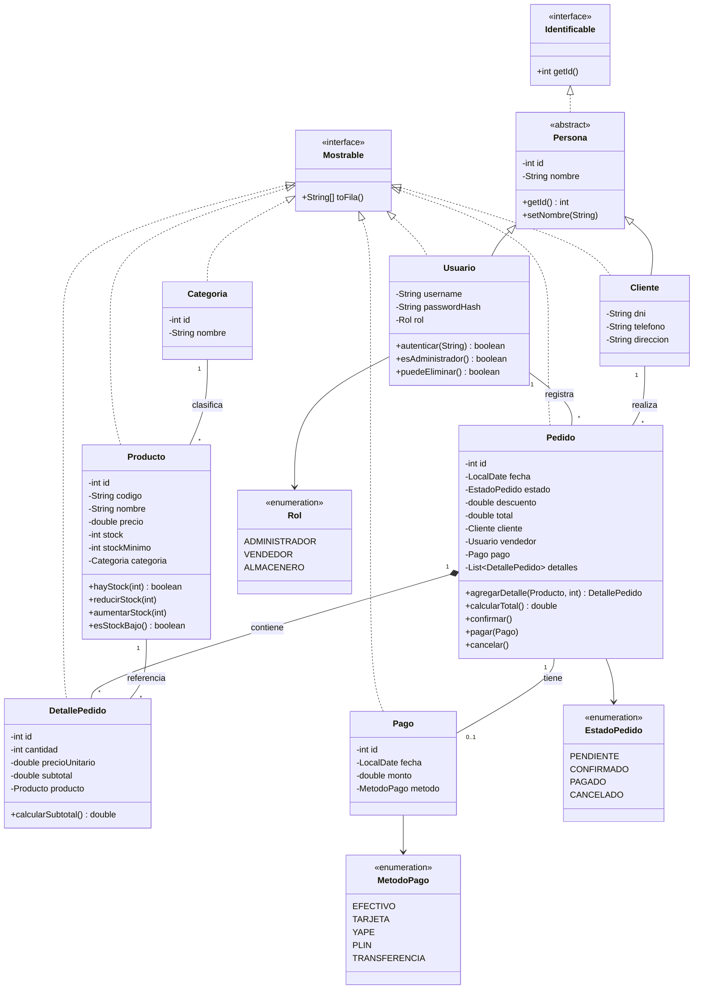

# Diagrama UML de clases - SGPI

Diagrama de clases del dominio implementado en la primera version funcional de
**El Ahorro - Tienda de Tecnologia**. Se incluye herencia (`Persona`),
interfaces (`Identificable`, `Mostrable`), composicion
(`Pedido *-- DetallePedido`) y enumeraciones.

## Notas de diseno

- **Herencia:** `Usuario` y `Cliente` heredan de la clase abstracta `Persona`.
- **Interfaces:** `Identificable` (contrato de identidad) y `Mostrable`
  (conversion a fila para CSV, base del polimorfismo).
- **Encapsulamiento:** atributos privados y validacion en constructores/setters
  (`Validador`).
- **Composicion:** `Pedido` es dueno de sus `DetallePedido`; si el pedido se
  elimina, sus detalles tambien.
- **Inmutabilidad (RN-05):** `DetallePedido.precioUnitario` y `Pago.monto` son
  `final`, por lo que el precio de venta no cambia despues de registrado.
- **Arquitectura:** separacion en capas `modelo`, `repositorio`, `servicio`,
  `vista`, `util` (estilo MVC/DAO).
